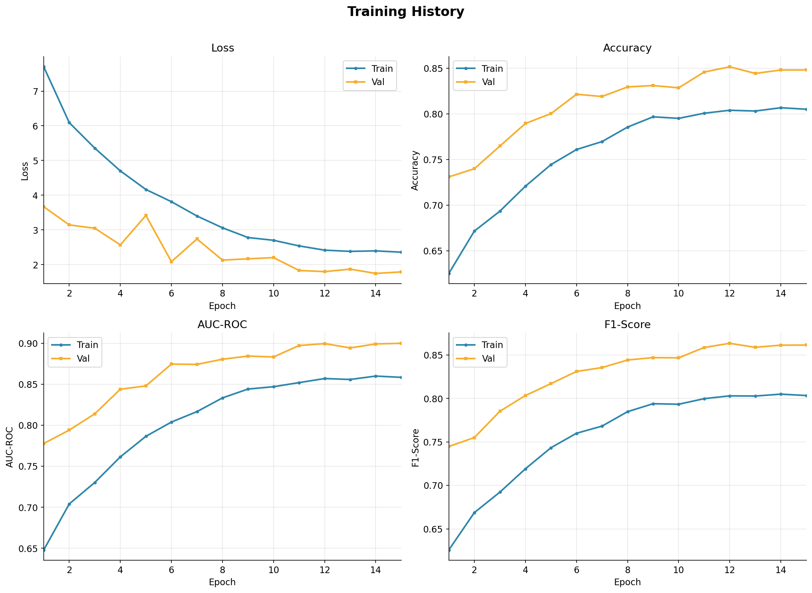
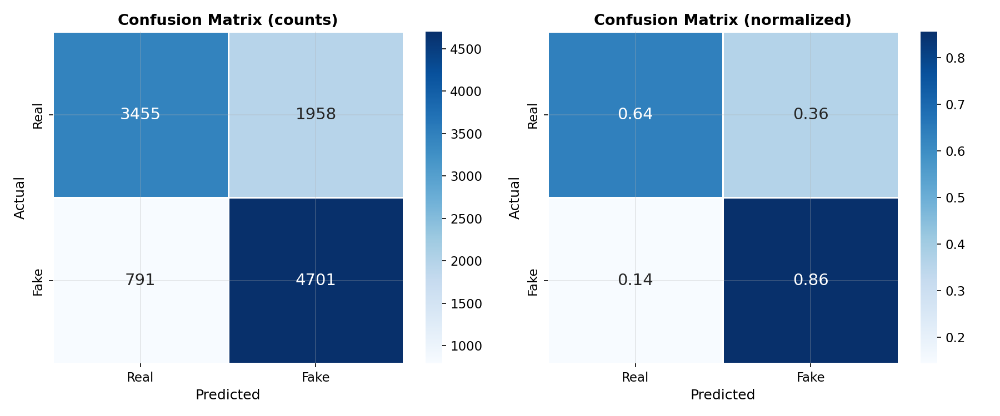
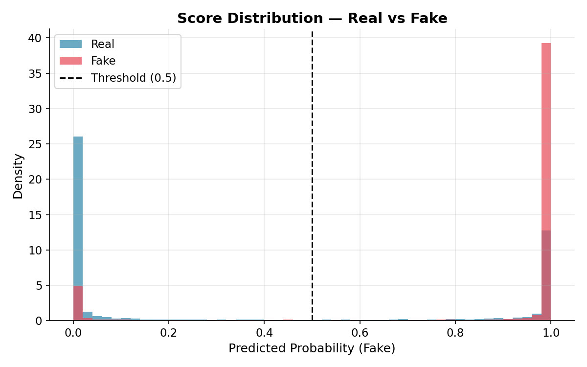
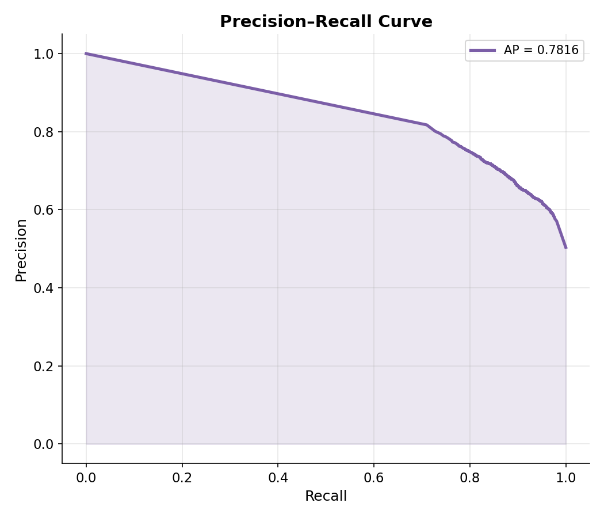
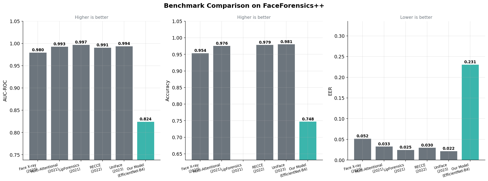

# 🔍 Deepfake Image Detection System

<p align="center">
  
</p>

<p align="center">
  <a href="#"></a>
  <a href="#"></a>
  <a href="#"></a>
  <a href="#"></a>
  <a href="#"></a>
</p>

> A deep learning system for detecting AI-generated (deepfake) facial images using **transfer learning** with **EfficientNet-B0**, trained on the Kaggle Deepfake and Real Images dataset, evaluated with AUC-ROC, EER, and explained with Grad-CAM++ visualizations.

**Authors:** Farrukh Imran (23K-0776) · Asher Ahmed (23K-0511)
**Course:** Deep Learning for Perception — FAST-NUCES Karachi

---

## 📋 Table of Contents

- [Overview](#overview)
- [Detection Methodology](#detection-methodology)
- [Dataset](#dataset)
- [Results](#results)
- [Benchmark Comparison](#benchmark-comparison)
- [Grad-CAM Explainability](#grad-cam-explainability)
- [Setup](#setup)
- [Usage](#usage)
- [Project Structure](#project-structure)

---

## Overview

Deepfake images — synthetically manipulated faces generated by GANs and autoencoders — pose serious risks to misinformation, fraud, and privacy. This project builds a robust binary classifier to distinguish **real** from **fake** facial images using transfer learning.

### Key Features
- **EfficientNet-B0 backbone** pretrained on ImageNet, fine-tuned on deepfake data
- **Two-phase training**: frozen backbone (2 epochs) → full fine-tuning (13 epochs)
- **Focal Loss** with BCEWithLogitsLoss for stable mixed-precision training
- **Grad-CAM++** explainability showing which face regions triggered the decision
- **Full evaluation**: AUC-ROC, EER, Accuracy, F1, Precision, Recall, Confusion Matrix
- **Benchmark comparison** against 5 published SOTA methods

---

## Detection Methodology

```
┌─────────────────────────────────────────────────────────────────┐
│                     DETECTION PIPELINE                          │
│                                                                 │
│  Input Image (128 × 128 × 3)                                    │
│       │                                                         │
│       ▼                                                         │
│  Preprocessing & Augmentation                                   │
│  Resize · Normalize · Flip · Rotate · JPEG · Blur · Dropout    │
│       │                                                         │
│       ▼                                                         │
│  EfficientNet-B0 Backbone (pretrained — ImageNet)               │
│  Frozen (Epochs 1–2)  →  Full fine-tune (Epochs 3–15)          │
│       │                                                         │
│       ▼                                                         │
│  Global Average Pooling → 1,280 features                        │
│       │                                                         │
│       ▼                                                         │
│  Classification Head                                            │
│  Dropout(0.4) → FC(1280→512) → BN → ReLU → Dropout(0.3) → FC(512→1) │
│       │                                                         │
│       ▼                                                         │
│  Sigmoid → P(Fake) ∈ [0,1]                                      │
│  P < 0.5 → REAL    |    P ≥ 0.5 → FAKE                        │
│       │                                                         │
│   ┌───┴────┐                                                    │
│   ▼        ▼                                                    │
│  Metrics  Grad-CAM++                                            │
│  AUC·EER  Attention heatmaps                                    │
│  Acc·F1   on face regions                                       │
└─────────────────────────────────────────────────────────────────┘
```

### Architecture Details

| Component | Details |
|-----------|---------|
| Backbone | EfficientNet-B0 (pretrained ImageNet) |
| Input size | 128 × 128 × 3 |
| Feature dim | 1,280 |
| Classifier | FC(1280→512) → BN → ReLU → FC(512→1) → Sigmoid |
| Loss | Focal Loss (α=0.8, γ=2.0) via BCEWithLogitsLoss |
| Optimizer | AdamW (lr=1e-4, weight_decay=1e-5) |
| Scheduler | Cosine Annealing |
| Augmentation | Flip, Rotation ±15°, Brightness/Contrast, JPEG compression, Gaussian blur, Coarse dropout |

---

## Dataset

### Kaggle — Deepfake and Real Images

| Split | Real | Fake | Used in Training | Purpose |
|-------|------|------|-----------------|---------|
| Train | 70,000 | 70,000 | 15,000 / class | Model training |
| Validation | 20,000 | 20,000 | 2,000 / class | Tuning & early stop |
| Test | 5,413 | 5,492 | All 10,905 | Final evaluation |

**Source:** [kaggle.com/datasets/manjilkarki/deepfake-and-real-images](https://www.kaggle.com/datasets/manjilkarki/deepfake-and-real-images)

### Types of Deepfakes Targeted

| Type | Description |
|------|-------------|
| **Identity Swap** | One person's face replaced with another using autoencoders |
| **GAN-Generated** | Completely synthetic faces that belong to no real person |
| **Face Reenactment** | Expressions/head movements transferred between identities |
| **Attribute Manipulation** | Subtle edits to age, gender, or emotion on real faces |

### Dataset Setup

```bash
# Download from Kaggle and place in:
data/
  train/real/    ← 70k real images (sample 15k used)
  train/fake/    ← 70k fake images (sample 15k used)
  val/real/      ← 20k real images (sample 2k used)
  val/fake/      ← 20k fake images (sample 2k used)
  test/real/     ← 5,413 real images (all used)
  test/fake/     ← 5,492 fake images (all used)
```

---

## Results

> Evaluated on the full held-out test set (10,905 images)

| Metric | Train | Validation | **Test** |
|--------|-------|-----------|---------|
| **AUC-ROC** | 0.8585 | 0.9000 | **0.8244** |
| **EER** | — | — | **0.2310 (23.10%)** |
| **Accuracy** | 80.51% | 85.15% | **74.79%** |
| **F1-Score** | 0.8034 | 0.8635 | **0.7738** |
| Precision | — | — | 0.7060 |
| Recall | — | — | 0.8560 |

### Training Curves

<p align="center">
  
</p>

### Confusion Matrix

<p align="center">
  
</p>

The model correctly classifies **86% of fake images** (high recall) — important for security applications where missing a deepfake is more costly than a false alarm.

### Score Distribution & PR Curve

| Score Distribution | Precision-Recall Curve |
|---|---|
|  |  |

Scores cluster strongly near 0 (real) and 1 (fake), showing confident predictions. Average Precision = **0.7816**.

---

## Benchmark Comparison

Comparison with published deepfake detection methods (benchmark methods trained on FaceForensics++):

| Method | Year | AUC | Accuracy | EER |
|--------|------|-----|----------|-----|
| Face X-ray | 2020 | 0.980 | 95.40% | 0.052 |
| Multi-Attentional | 2021 | 0.993 | 97.60% | 0.033 |
| LipForensics | 2021 | 0.997 | — | 0.025 |
| RECCE | 2022 | 0.991 | 97.90% | 0.030 |
| UniFace | 2023 | 0.994 | 98.10% | 0.022 |
| **Ours (EfficientNet-B0)** | 2024 | **0.8244** | **74.79%** | **0.2310** |

> *Different training dataset — comparison is indicative, not direct.*

<p align="center">
  
</p>

Our model is a simple single-backbone baseline trained in under 50 minutes on a free Colab GPU. Specialized architectures trained on FF++ with full compute budgets expectedly outperform, but our approach demonstrates the strength of transfer learning as a starting point.

---

## Grad-CAM Explainability

Grad-CAM++ heatmaps show which face regions the model focuses on. Warm colors (red/yellow) = high model attention.

| GT: Real → Pred: Real ✓ | GT: Fake → Pred: Fake ✓ | GT: Fake → Pred: Real ✗ |
|---|---|---|
|  |  |  |

For correctly detected fakes, the model focuses on **face boundaries and texture inconsistencies** — genuine deepfake artifacts. The misclassified fake (right) shows scattered attention, suggesting a high-quality deepfake with minimal visible artifacts.

---

## Setup

### Prerequisites
- Python 3.10+ (3.11 recommended)
- CUDA GPU recommended for training (CPU inference works fine)

### Installation

```bash
git clone https://github.com/YOUR_USERNAME/deepfake-detection.git
cd deepfake-detection

python -m venv venv
venv\Scripts\activate        # Windows
# source venv/bin/activate   # Linux/Mac

pip install -r requirements.txt
```

---

## Usage

### Train (on Google Colab — recommended)

Open `notebooks/02_train_colab.ipynb` in Colab with T4 GPU enabled.

### Train locally

```bash
python src/train.py
```

### Evaluate on test set

```bash
python src/evaluate.py --config config.yaml
```

### Predict a single image

```bash
# Prediction only
python src/inference.py --image path/to/face.jpg

# With Grad-CAM heatmap
python src/inference.py --image path/to/face.jpg --gradcam
```

### Predict a folder of images

```bash
python src/inference.py --folder path/to/images/ --output results/predictions.csv
```

### TensorBoard

```bash
tensorboard --logdir logs/
```

---

## Project Structure

```
deepfake-detection/
├── config.yaml              ← All hyperparameters
├── requirements.txt
├── README.md
│
├── data/
│   ├── train/real/          ← Real training faces
│   ├── train/fake/          ← Fake training faces
│   ├── val/real/  val/fake/
│   └── test/real/ test/fake/
│
├── src/
│   ├── dataset.py           ← Data loading & augmentation
│   ├── model.py             ← EfficientNet-B0 model
│   ├── train.py             ← Training loop (AMP, early stopping)
│   ├── evaluate.py          ← AUC, EER, plots, benchmark comparison
│   ├── gradcam.py           ← Grad-CAM++ explainability
│   ├── inference.py         ← Single image & batch prediction
│   └── utils.py             ← Shared utilities
│
├── notebooks/
│   ├── 01_eda.ipynb         ← Exploratory data analysis (Colab ready)
│   └── 02_train_colab.ipynb ← Full training pipeline for Colab
│
├── results/
│   ├── plots/               ← Training curves, ROC, confusion matrix, benchmarks
│   ├── metrics/             ← test_metrics.json, benchmark_comparison.csv
│   └── gradcam/             ← Grad-CAM++ visualizations
│
├── checkpoints/             ← Saved model weights (best_model.pth)
└── logs/                    ← TensorBoard logs
```

---

## Future Work

- **Video detection** — temporal analysis with 3D CNNs on consecutive frames
- **Higher resolution** — train at 224×224 with full dataset for better accuracy
- **Ensemble models** — combine EfficientNet + Xception for higher AUC

---

## References

1. Rössler et al. — *FaceForensics++* (ICCV 2019)
2. Li et al. — *Face X-ray for More General Face Forgery Detection* (CVPR 2020)
3. Zhao et al. — *Multi-Attentional Deepfake Detection* (CVPR 2021)
4. Haliassos et al. — *LipForensics* (CVPR 2021)
5. Tan & Le — *EfficientNet* (ICML 2019)
6. Selvaraju et al. — *Grad-CAM* (ICCV 2017)
7. Karki — *Deepfake and Real Images Dataset* (Kaggle, 2023)

---

## License

MIT License

---

<p align="center">
  Deep Learning for Perception — FAST-NUCES Karachi<br>
  Farrukh Imran (23K-0776) · Asher Ahmed (23K-0511)
</p>
