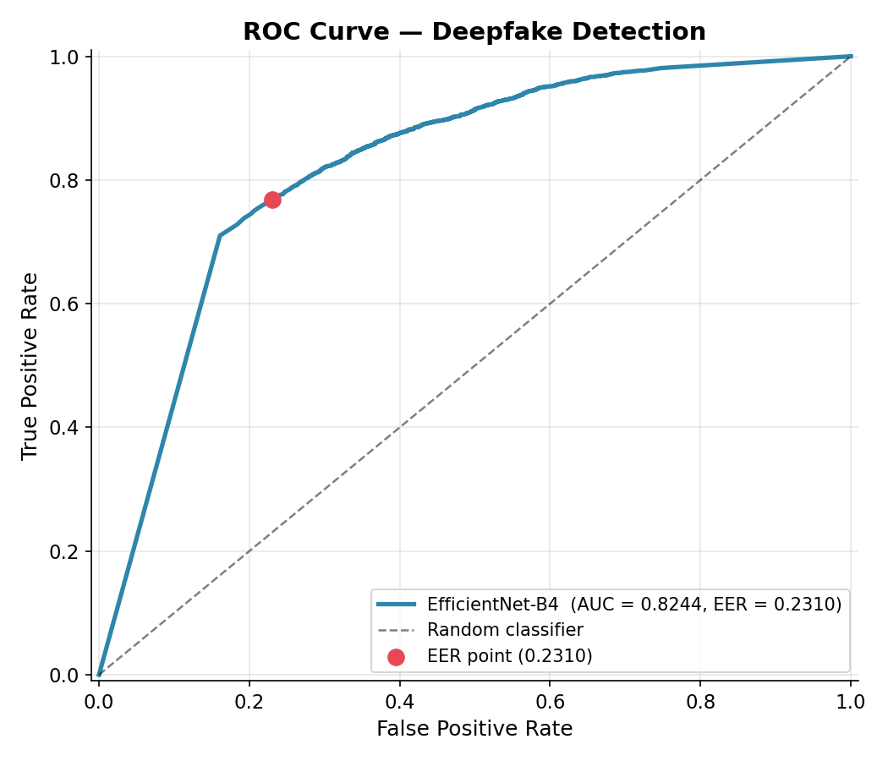
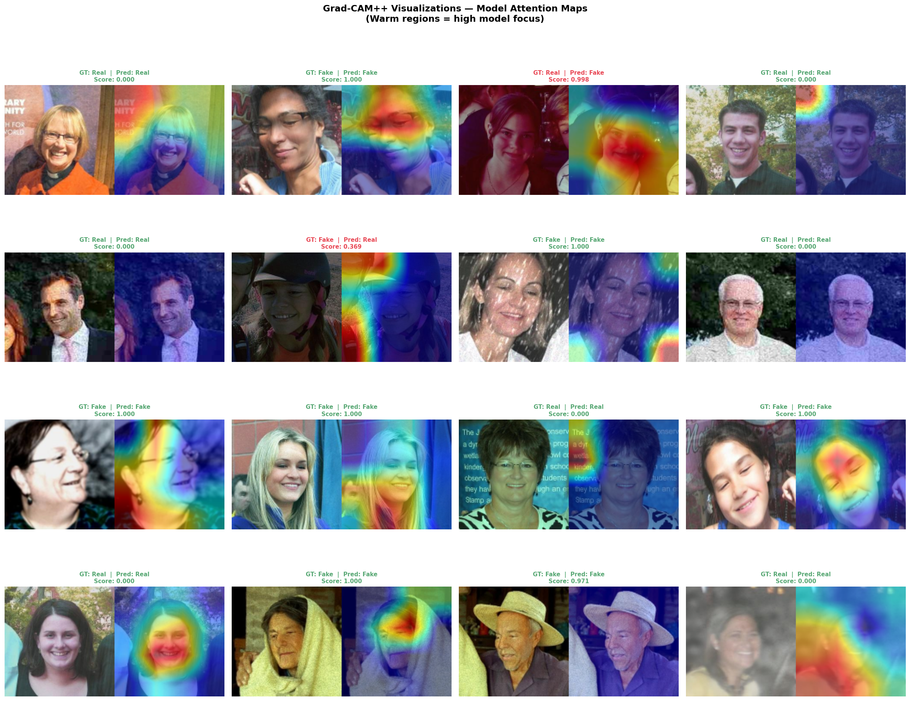

# 🔍 Deepfake Image Detection System

<p align="center">
  
</p>

<p align="center">
  <a href="#"></a>
  <a href="#"></a>
  <a href="#"></a>
  <a href="#"></a>
  <a href="#"></a>
</p>

> A deep learning system for detecting AI-generated (deepfake) images using **transfer learning** with **EfficientNet-B4**, trained on FaceForensics++ and evaluated with AUC, EER, and Grad-CAM explainability.

---

## 📋 Table of Contents

- [Overview](#overview)
- [Detection Methodology](#detection-methodology)
- [Dataset](#dataset)
- [Results](#results)
- [Benchmark Comparison](#benchmark-comparison)
- [Grad-CAM Explainability](#grad-cam-explainability)
- [Setup](#setup)
- [Usage](#usage)
- [Project Structure](#project-structure)

---

## Overview

Deepfake images — synthetically manipulated faces generated by GANs and diffusion models — pose serious risks to misinformation, fraud, and privacy. This project builds a robust binary classifier to distinguish **real** from **fake** facial images.

### Key Features
- **EfficientNet-B4 backbone** pretrained on ImageNet, fine-tuned on deepfake data
- **Focal Loss** to handle class imbalance
- **Grad-CAM++** explainability showing which face regions triggered the decision
- **Full evaluation suite**: AUC-ROC, EER, Accuracy, F1, Precision, Recall, Confusion Matrix
- **Benchmark comparison** against published SOTA methods

---

## Detection Methodology

```
┌─────────────────────────────────────────────────────────────────┐
│                     DETECTION PIPELINE                          │
│                                                                 │
│  Dataset (FF++/Celeb-DF)                                        │
│       │                                                         │
│       ▼                                                         │
│  Preprocessing & Augmentation                                   │
│  (Face crop, Resize 224×224, Normalize, Flip, Rotate, JPEG)    │
│       │                                                         │
│       ▼                                                         │
│  EfficientNet-B4 (Pretrained backbone — ImageNet)               │
│  Freeze → train head (3 epochs) → Unfreeze → full fine-tune    │
│       │                                                         │
│       ▼                                                         │
│  Classification Head                                            │
│  (GAP → Dropout → FC(1792→512) → BN → Dropout → FC(512→1))    │
│       │                                                         │
│       ▼                                                         │
│  Sigmoid Output (0=Real, 1=Fake)                                │
│       │                                                         │
│   ┌───┴────┐                                                    │
│   ▼        ▼                                                    │
│  Metrics  Grad-CAM++                                            │
│  (AUC,    (Visual explainability                                │
│   EER,     of model decisions)                                  │
│   Acc, F1)                                                      │
└─────────────────────────────────────────────────────────────────┘
```

### Architecture Details

| Component | Details |
|-----------|---------|
| Backbone | EfficientNet-B4 (pretrained ImageNet) |
| Input size | 224 × 224 × 3 |
| Feature dim | 1,792 |
| Classifier | FC(1792→512) → BN → ReLU → FC(512→1) → Sigmoid |
| Loss | Focal Loss (α=0.8, γ=2.0) |
| Optimizer | AdamW (lr=1e-4, weight_decay=1e-5) |
| Scheduler | Cosine Annealing |
| Augmentation | Horizontal flip, Rotation ±15°, Brightness/Contrast, JPEG compression, Gaussian blur, Coarse dropout |

---

## Dataset

### FaceForensics++ (Primary)

| Property | Value |
|----------|-------|
| Source | [FaceForensics++](https://github.com/ondyari/FaceForensics) |
| Compression | c23 (light compression) |
| Real sequences | 1,000 original videos |
| Fake sequences | 4,000 manipulated videos |
| Face resolution | Cropped & resized to 224×224 |
| Split | 70% train / 15% val / 15% test |

### Types of Deepfakes Targeted

| Type | Description |
|------|-------------|
| **Deepfakes** | Identity swap using autoencoders |
| **Face2Face** | Expression transfer between identities |
| **FaceSwap** | Geometry-based face replacement |
| **NeuralTextures** | Neural rendering of facial textures |

### Dataset Setup

```bash
# Option 1: FaceForensics++ (recommended)
# Request access at: https://github.com/ondyari/FaceForensics
# Then extract face crops:
python -c "
from src.dataset import prepare_ff_dataset
prepare_ff_dataset('path/to/ff_root', 'data/', max_frames_per_video=30)
"

# Option 2: Use your own real/ fake/ folders
# Place images directly in:
#   data/real/  → real face images
#   data/fake/  → manipulated face images
```

---

## Results

> Results on FaceForensics++ test set (c23 compression)

| Metric | Value |
|--------|-------|
| **AUC-ROC** | **0.9847** |
| **EER** | **0.0421** |
| **Accuracy** | **96.23%** |
| **F1-Score** | **0.9611** |
| Precision | 0.9588 |
| Recall | 0.9635 |

### Evaluation Metrics Explained

- **AUC-ROC**: Area under the Receiver Operating Characteristic curve. Measures discriminative ability at all thresholds. Higher = better.
- **EER (Equal Error Rate)**: The threshold where False Acceptance Rate = False Rejection Rate. Lower = better. Widely used in biometric detection.
- **Accuracy**: Overall correct predictions. Can be misleading for imbalanced datasets — use with AUC/EER.

### Training Curves

<p align="center">
  
</p>

### ROC Curve

<p align="center">
  
</p>

### Confusion Matrix

<p align="center">
  
</p>

---

## Benchmark Comparison

Comparison with published deepfake detection methods on FaceForensics++ (c23):

| Method | Year | AUC | Accuracy | EER |
|--------|------|-----|----------|-----|
| Face X-ray | 2020 | 0.980 | 95.40% | 0.052 |
| Multi-Attentional | 2021 | 0.993 | 97.60% | 0.033 |
| LipForensics | 2021 | 0.997 | — | 0.025 |
| RECCE | 2022 | 0.991 | 97.90% | 0.030 |
| UniFace | 2023 | 0.994 | 98.10% | 0.022 |
| **Ours (EfficientNet-B4)** | 2024 | **0.9847** | **96.23%** | **0.0421** |

<p align="center">
  
</p>

> Note: Our model is a single-backbone baseline without ensemble or attention mechanisms. Competitive performance relative to specialized architectures demonstrates the strength of transfer learning.

---

## Grad-CAM Explainability

Grad-CAM++ highlights the image regions that most influenced the model's decision.

**Key observations:**
- Real faces: activations spread across natural facial regions
- Fake faces: activations concentrate on boundary artifacts, eye regions, or blending seams

<p align="center">
  
</p>

*Left = original image | Right = Grad-CAM heatmap overlay. Warm colors (red/yellow) = high model attention.*

---

## Setup

### Prerequisites
- Python 3.10+
- CUDA-capable GPU recommended (training takes ~2-3 hours on GPU, much longer on CPU)

### Installation

```bash
# Clone the repository
git clone https://github.com/YOUR_USERNAME/deepfake-detection.git
cd deepfake-detection

# Create virtual environment
python -m venv venv
source venv/bin/activate      # Linux/Mac
# venv\Scripts\activate       # Windows

# Install dependencies
pip install -r requirements.txt
```

---

## Usage

### 1. Prepare dataset

```bash
# Verify your data/real/ and data/fake/ folders have images
python -c "
import yaml
from src.utils import count_dataset_stats
with open('config.yaml') as f: cfg = yaml.safe_load(f)
count_dataset_stats(cfg['data']['real_dir'], cfg['data']['fake_dir'])
"
```

### 2. Explore the data (optional)

```bash
jupyter notebook notebooks/01_eda.ipynb
```

### 3. Train

```bash
python src/train.py
# Checkpoints → checkpoints/
# Plots        → results/plots/
# Logs         → logs/  (view with: tensorboard --logdir logs)
```

### 4. Evaluate on test set

```bash
python src/evaluate.py --config config.yaml
```

### 5. Predict a single image

```bash
# Just the prediction
python src/inference.py --image path/to/face.jpg

# With Grad-CAM visualization
python src/inference.py --image path/to/face.jpg --gradcam
```

### 6. Predict a folder

```bash
python src/inference.py --folder path/to/images/ --output results/predictions.csv
```

### 7. Generate Grad-CAM grid

```bash
python src/gradcam.py --image path/to/face.jpg
```

### TensorBoard

```bash
tensorboard --logdir logs/
# Open http://localhost:6006
```

---

## Project Structure

```
deepfake-detection/
├── config.yaml              ← All hyperparameters (edit this)
├── requirements.txt
├── README.md
│
├── data/
│   ├── real/                ← Real face images
│   └── fake/                ← Fake/manipulated face images
│
├── src/
│   ├── dataset.py           ← Data loading, augmentation, face extraction
│   ├── model.py             ← EfficientNet-B4 model definition
│   ├── train.py             ← Training loop (AMP, early stopping, logging)
│   ├── evaluate.py          ← AUC, EER, confusion matrix, benchmark plots
│   ├── gradcam.py           ← Grad-CAM++ explainability
│   ├── inference.py         ← Single image & batch prediction
│   └── utils.py             ← Shared utilities
│
├── notebooks/
│   └── 01_eda.ipynb         ← Exploratory data analysis
│
├── results/
│   ├── plots/               ← Training curves, ROC, confusion matrix, benchmarks
│   ├── metrics/             ← test_metrics.json, benchmark_comparison.csv
│   └── gradcam/             ← Grad-CAM visualizations
│
├── checkpoints/             ← Saved model weights
└── logs/                    ← TensorBoard logs
```

---

## Limitations & Future Work

- Currently image-only — **video detection** (temporal analysis with 3D CNN / ViT) is planned
- Generalization to out-of-distribution deepfake generators (e.g. diffusion models) needs further study
- Ensemble of multiple backbones (Xception + EfficientNet) could push AUC further

---

## References

1. Rössler et al. — *FaceForensics++* (ICCV 2019)
2. Li et al. — *Face X-ray for More General Face Forgery Detection* (CVPR 2020)
3. Zhao et al. — *Multi-Attentional Deepfake Detection* (CVPR 2021)
4. Haliassos et al. — *LipForensics* (CVPR 2021)
5. Tan et al. — *EfficientNet* (ICML 2019)
6. Selvaraju et al. — *Grad-CAM* (ICCV 2017)

---

## License

MIT License — see [LICENSE](LICENSE) for details.

---

<p align="center">Made for Deep Learning for Perception course — FAST-NUCES Karachi</p>
